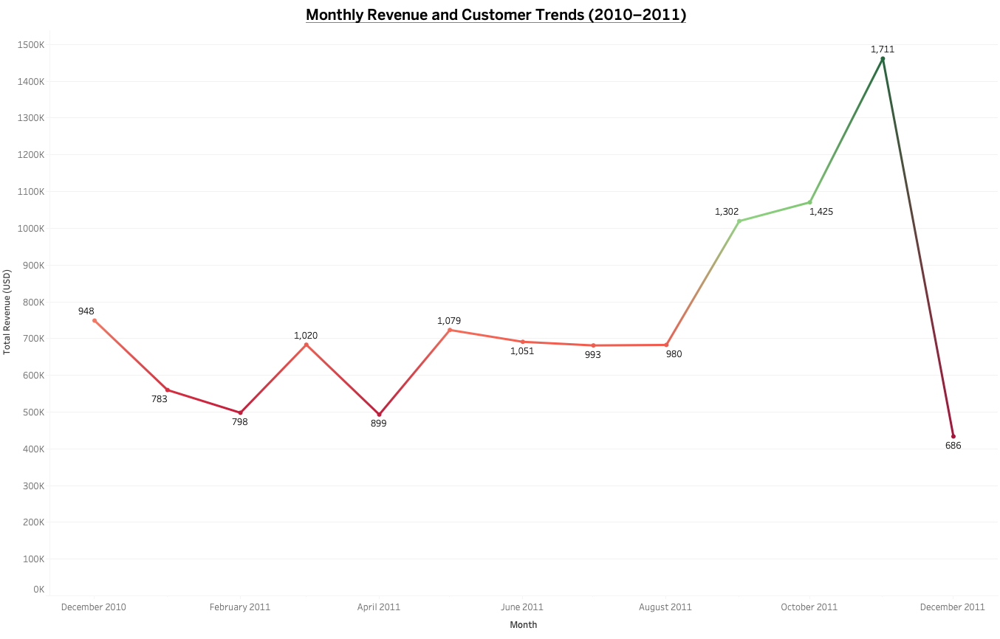
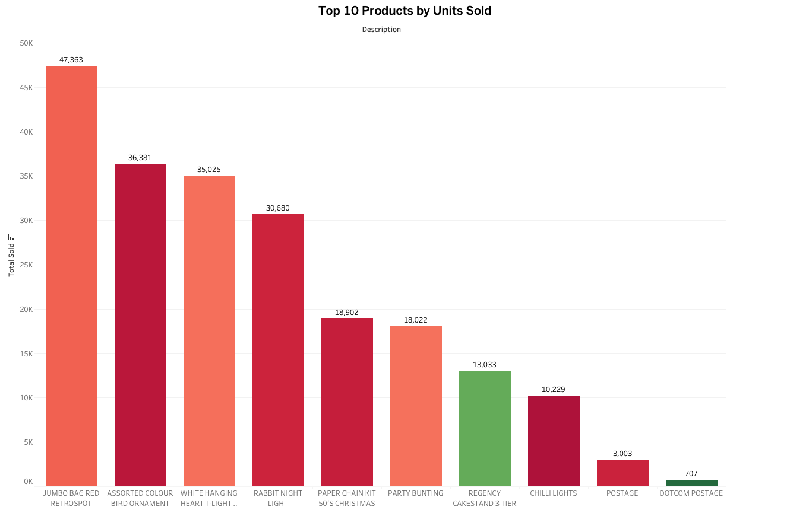
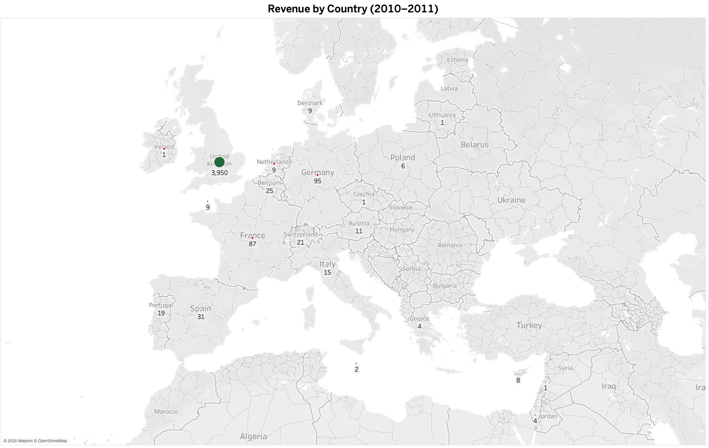

# E-Commerce Analytics Dashboard (dbt + DuckDB + Tableau)

This project showcases a full data pipeline and dashboard built from a UK-based e-commerce dataset (2010–2011). It uses **dbt** for data modeling and transformation, **DuckDB** as the local warehouse, and **Tableau Public** for interactive visualizations.

---

## Tools & Technologies

- **dbt-duckdb**: SQL-based data modeling and transformation
- **DuckDB**: Local analytics database for storing model outputs
- **Python**: For reading DuckDB models and exporting to CSV
- **Tableau Public**: For designing and publishing dashboards
- **Git + GitHub**: Version control and project sharing

---

## Project Workflow

### 1. Data Preparation
- Used a public e-commerce dataset with customer transactions from [Kaggle](https://www.kaggle.com/datasets/carrie1/ecommerce-data)
- Cleaned and stored CSV in a `/data/` folder

### 2. dbt Modeling
- Set up a local dbt project using DuckDB adapter
- Created the following models:
  - `stg_orders`: Staging model to clean and cast raw CSV data
  - `fct_monthly_sales`: Monthly revenue, quantity, and unique customers
  - `dim_customers`: Total purchases, items bought, and revenue per customer
  - `fct_top_products`: Top 10 products by total revenue and units sold
  - `fct_country_sales`: Revenue and customer count by country

### 3. Python Export
- Queried each dbt model using Python and `duckdb`
- Exported the final model outputs as CSVs to the `data/` folder

### 4. Tableau Visualization
- Connected to the exported CSVs in Tableau Public
- Built 3 key visualizations:
  - Monthly Revenue Trend (Line Chart)
  - Top Products by Units Sold (Bar Chart)
  - Revenue by Country (Map)
- Combined all views into an interactive dashboard
- Published the dashboard to Tableau Public

---

## Key Insights

- **Revenue Trends**: Sales spiked in November–December, likely due to holiday shopping.
- **Top Products**: Gift sets and vintage-themed items drove most of the revenue.
- **Customer Behavior**: A small portion of customers were highly active buyers.
- **Geography**: The UK led all countries in sales volume and revenue.

---

## Dashboard Snapshots

### Monthly Revenue Trend

### Top 10 Products by Units Sold

### Revenue by Country

---

## Live Dashboard

🔗 [View the dashboard on Tableau Public](https://public.tableau.com/views/E-CommerceSalesDashboard_17450876728310/Dashboard1?:language=en-US&:sid=&:redirect=auth&:display_count=n&:origin=viz_share_link)

---

## Tableau Workbook

You can also find the full Tableau workbook:
- `ecommerce_dashboard.twbx`

---
